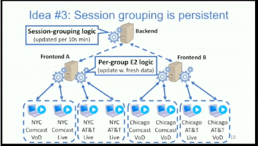

# Pytheas: Enabling Data-Driven Quality of Experience Optimization Using Group-Based Exploration-Exploitation

Using frontend Server to make decision locally (fast). and using backend server to make decision globally (have latency)
