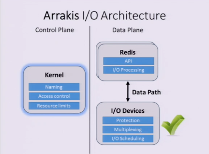

Arrakis: The Operating System is the Control Plane

I/O hardware is fast enough.

The reason why I/O is slow because of OS overhead, e.g. multiplex/de-multiplexing. isolation, I/O scheduling.

Arrakis skip kernel and direct let application to get data from NIC

