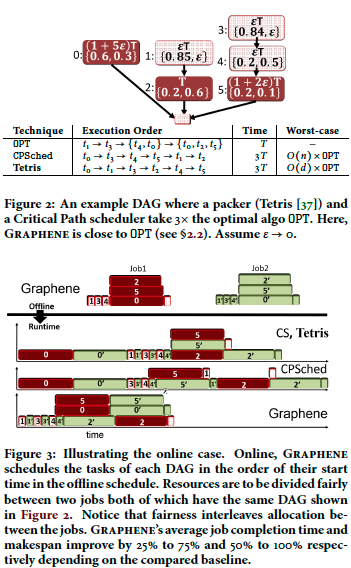

#Graphene: Packing and Dependency-aware Scheduling for Data-Parallel Clusters

##What Graphene do
1. after generation of job DAG, it first group tasks into groups of tasks that are not troublesome. and identifies troublesome tasks. 
2. The scheduler places troublesome tasks first.

# Different from existing schedulers:
Existing: A task is scheduled after all its parents finished

Graphene: identify troublesome tasks first and place them, then place other tasks around the troupble 

# Example of different scheduling
Here are good examples to show that Graphene can performs better than existing scheduling schemes in both online and offline scenarios.

## How to use Graphene in Multiple DAGs
1 convert offline schedule to priority order on tasks

2. For online scheduling, enforce schedule priority along with heuristics(e.g. fairness, JCT, packing efficiency)

#Nugget
1 Offline: troublesome tasks first (For each DAG)

2 Online: enforce priority over tasks along with other heuristics.
