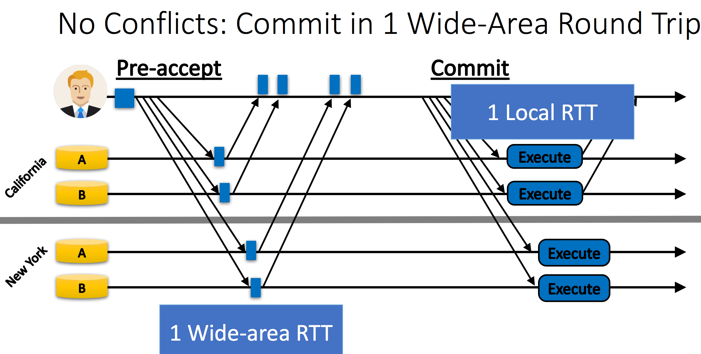
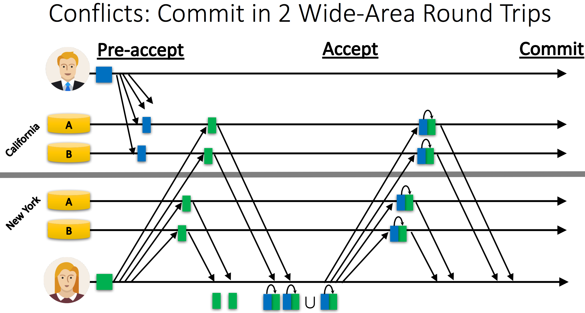

#Janus: Consolidating Concurrency Control and Consensus for Commits under Conflicts

##problem
Current conventioanl fault-tolerant distributed transactions has a *concurrency control* layer on top of Paxos *consensus protocol*.

Therefore, we need 2 coordiantion in cross-datacenter. one for concurrency control, one for consensus.Which means >= 2 RTT for coordination.

## Janus

one RTT coordination for both concurrency control & consensus. In addition, for contention of differnt transactions, Janus can handle it well via ensuring determinsitci execution re-ordering.

When contention of same transaction happens, Janus ensure no abortion of the commits while may need 2 RTT for replication transactions. It is shown in the following pic.

## Key takeaway
We need to consider separation of one unique move. Like TCP using SlowStart and AMID for both congestion control and fairness. So dina katabi seperate congestion control and fairness control to ensure better system performance. 

