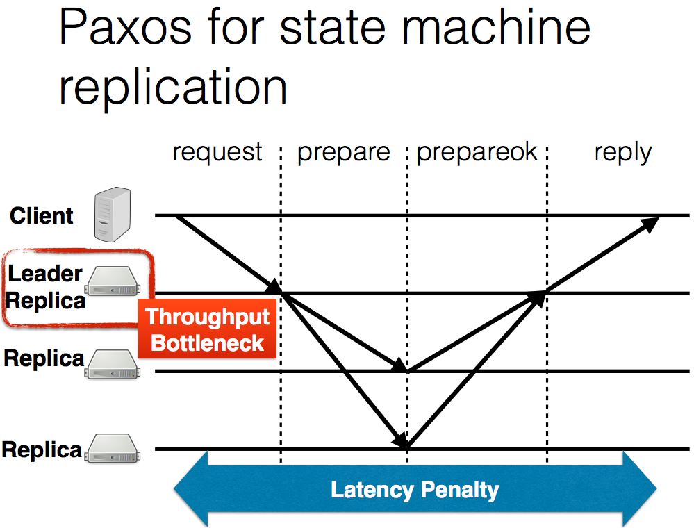
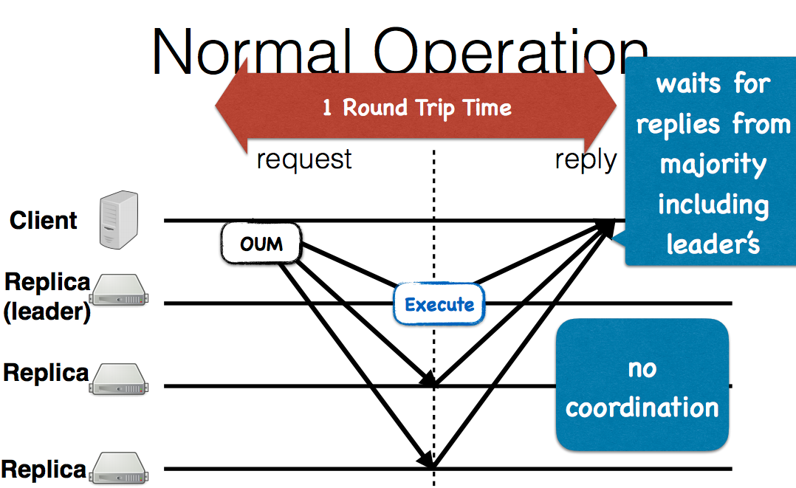

#Just Say NO to Paxos Overhead: Replacing Consensus with Network Ordering

Paxos overhead is sequencial copy data (e.g. first leader replica, then second replica, then third). In a asychronous network, this sequencial copy really introduce long delay. As shown in the figure below.

THe delay is illstrated in the figure.

Therefore, to mitigate this copy data to replica delay, the authors propose to use *multicast* for fast `inorder` data transmission, and also let host to ensure the data *reliability*, which is shown as the picture below.

