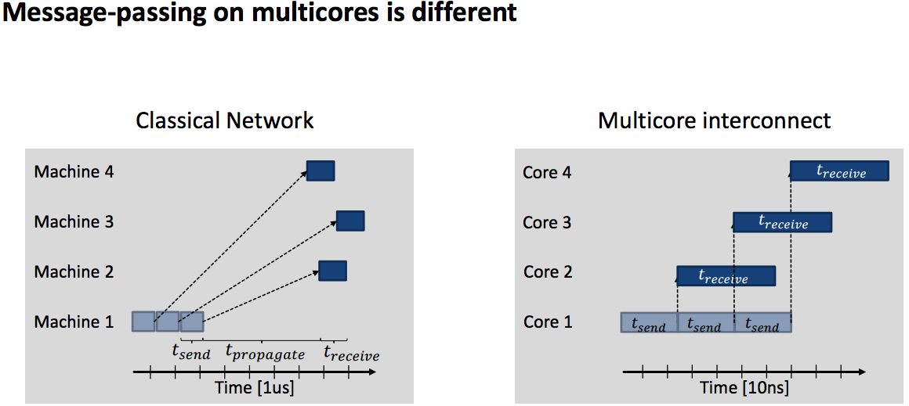

#Machine-aware Atomic Broadcast Trees for Multicores
##background
###`SMP`: Symmetric Multi-Processor 

all the cores are equal, and share all resources. 
If multiple requests from differnt cores on RAM => serialize access

###`NUMA`: Non-Uniform Memory Access

SMP => limited scalibility (CPU :arrow_up: => conflict in Access MEM :arrow_up:)

NUMA: a group of CPU has shared local MEM. All groups are connected by crossbar.

Shortcoming: latency of remote MEM access is much longer than local MEM access

###`MPP`:Massive Parallel Processing
group of SMP

Only local MEM access within a SMP, No remote MEM access among SMPs.

##Difference in messaging among nodes and cores
[][Difference in message passing]
##Problem
Generating a good tree structure for multi-core broadcasting is important.

Multi-core hardware is complex => hard to generate a tree that one fits all solution
