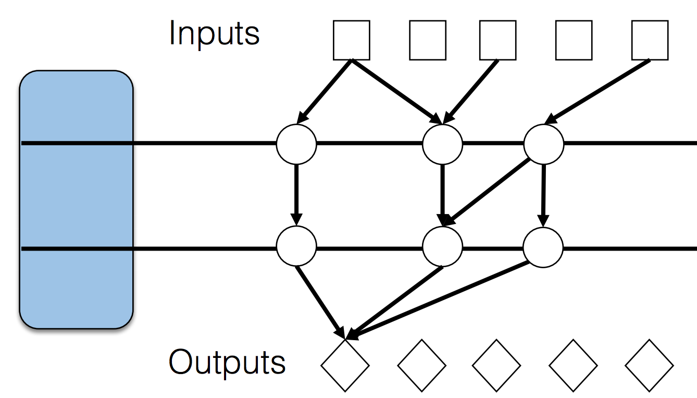
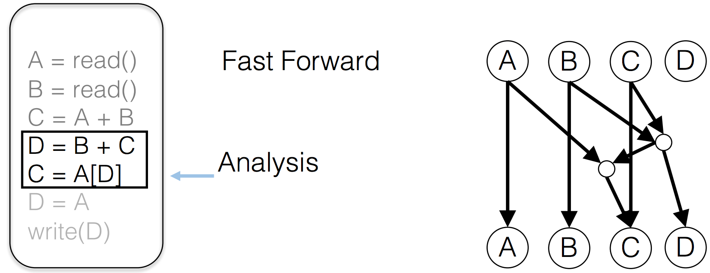

#JetStream:	Cluster-scale	Parallelization	of Information Flow Queries

##Dynamic information flow tracking (DIFT)
DIFT to track execution causality, also known as Taint Tracking.

##problem
Parallelizing DIFT is hard. Because of sequential dependencies.

##solution:
Time slice execution into Epochs

Here is a specific exmaple of how it works.

