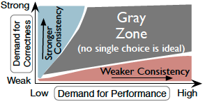

#Incremental Consistency Guarantees For Replicated Objects

##Problem 
there is a dilemma between consistency and latency for geo-distributed data replication query. 

If you want strong consistency, we have high latency & low avaiablity.

If you want low latency, we have low consistency & high avaiability.

However, neither is good.

hybrid introduce difficulty to developers.

##What they do

Focus on the grey area, combining consistency models in a single operation

Developer invoke operation and get multiple incremental views on the results.

Firs view is the low latency (weak consistency) one, and then higher latency (better consistency), so on and so forth.

## Key takeaway

###Make discrete/binary things into continuous.
