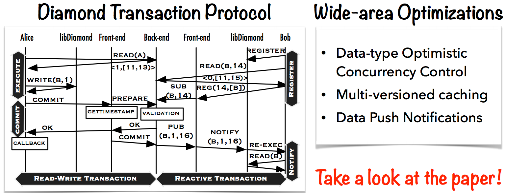

#Diamond: Automating Data Management and Storage for Wide-area, Reactive Applications

ACID+R: R is reactivity.

##Diamond
Automated end-to-end data management and storage.

* Using multi-layer cache
* data optimistic concurrency control
* Data Push notifications.
