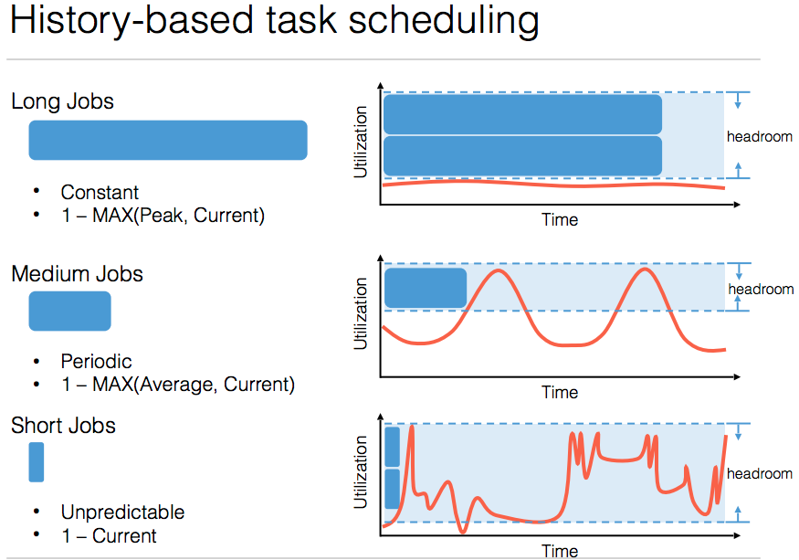

#History-Based Harvesting of Spare Cycles and Storage in Large-Scale Datacenters

* Using history to find out the under-utilized part of the cluster, and use it

* Leverage data replica to achieve data locality: using two dimentional data replica matrix to calculate the best replica position.

